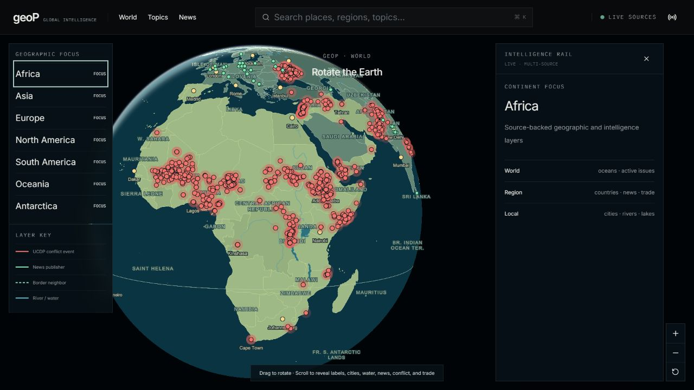
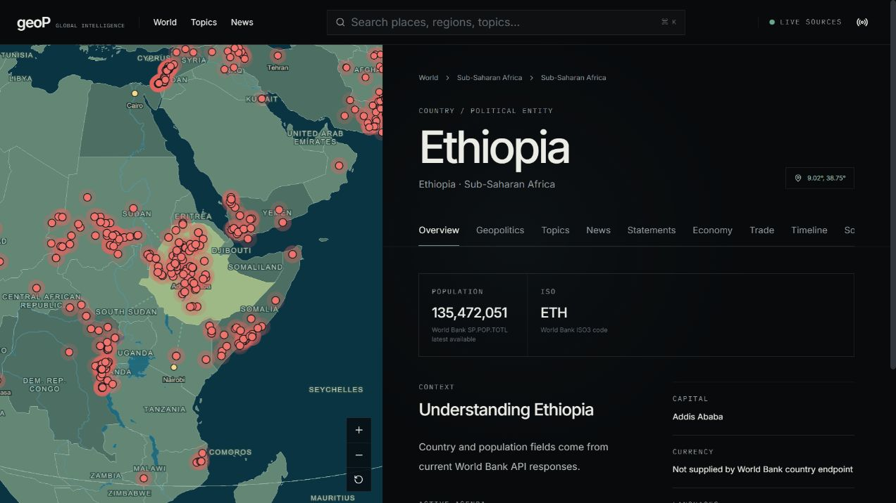

# geoP

geoP is a globe-centered geopolitical intelligence platform built to make countries, conflicts, reporting, physical geography, and economic context explorable in one interface. The globe stays upright, progressively reveals detail by zoom level, and keeps deeper intelligence in a side rail instead of covering the map.

## What it does

- Rotatable MapLibre globe with selectable continents and countries
- Country highlighting with geographic-neighbor and UCDP conflict links
- Scale-aware Natural Earth rivers, lakes, cities, and labels
- Georeferenced UCDP events with parties, fatality estimates, dates, and provenance
- Live reporting from GDELT with Wikimedia Current Events failover
- News imagery enriched through Wikimedia Commons with attribution metadata
- World Bank indicators, UN Comtrade flows, global search, topic timelines, and Swagger API documentation
- PostgreSQL persistence through Prisma when `DATABASE_URL` is configured

## Architecture

The application uses the Next.js 16 App Router and React 19 for the experience layer. TanStack Query manages remote state, Zustand manages globe focus, and MapLibre GL renders the geographic layers. A NestJS 11 API normalizes public providers, caches responses, exposes provenance, and writes successful ingestions to PostgreSQL through Prisma.

```text
Next.js → TanStack Query → NestJS API → public providers
                               └──────→ Prisma → PostgreSQL
```

## The system

The global view remains readable while showing real conflict and publisher activity. At regional zoom, country names, cities, rivers, lakes, event locations, and news markers become progressively denser.



Country pages keep the map and intelligence profile connected, with the selected state highlighted and its source-backed context alongside it.



## Technology stack

| Layer | Technology | Role in geoP |
| --- | --- | --- |
| Web application | Next.js 16 App Router, React 19, TypeScript | Server and client rendering, routing, layouts, and the interactive intelligence experience |
| Interface | Tailwind CSS, Lucide React | Responsive visual system, controls, navigation, and map-side intelligence panels |
| Globe and maps | MapLibre GL JS 6, WebGL globe projection | Upright rotatable 3D Earth, camera animation, zoom, geographic picking, and layered map rendering |
| Globe atmosphere | MapLibre atmosphere and fog rendering | Horizon depth, atmospheric color, and a readable globe silhouette |
| Geographic layers | GeoJSON, TopoJSON, Natural Earth, world-atlas | Countries, borders, cities, rivers, lakes, labels, and scale-aware physical geography |
| Map interaction | MapLibre feature queries and camera controls | Country selection, highlighting, hover previews, relationship lines, and animated fly-to navigation |
| Client data | TanStack Query, Axios | API requests, caching, retries, and live-data refresh |
| Client state | Zustand | Selected geography, globe focus, filters, and cross-page interaction state |
| Data visualization | Apache ECharts | Trade, economic, conflict, and timeline graphics |
| Backend API | NestJS 11, RxJS, class-validator | Provider orchestration, normalized intelligence endpoints, validation, caching, and scheduled ingestion |
| API contract | OpenAPI and Swagger via `@nestjs/swagger` | Interactive API documentation and typed endpoint discovery |
| Persistence | PostgreSQL, Prisma ORM | Durable storage, schema management, provider provenance, and successful-ingestion records |
| Security and delivery | Helmet, compression | HTTP security headers and compressed API responses |

The complete provider and endpoint inventory is in [API-SOURCES.md](API-SOURCES.md).

## Run locally

```bash
pnpm install
copy .env.example .env
pnpm db:generate
pnpm db:migrate
pnpm data:geography
pnpm dev
```

Set a real PostgreSQL password in `DATABASE_URL` before running the migration. The web app runs at `http://localhost:3000`, the API at `http://localhost:4000/api/v1`, and Swagger at `http://localhost:4000/api/docs`.

## Verification

```bash
pnpm typecheck
pnpm build:api
pnpm build
```

Provider failures are surfaced as unavailable states; geoP does not generate substitute records. UCDP values remain estimates tied to their release and precision fields, and Wikimedia media retains provider, artist, and license metadata.

geoP was created as a hands-on project for learning Next.js, NestJS, OpenAPI/Swagger, PostgreSQL, Prisma, and real-world API integration.
